# 航模遥控到机器人 <!-- omit from toc -->

# 目录 <!-- omit from toc -->

- [概述](#概述)
- [名词解释](#名词解释)
- [系统组成](#系统组成)
  - [传统遥控方式](#传统遥控方式)
  - [双向遥控方式](#双向遥控方式)
- [实际应用](#实际应用)
  - [硬件选择](#硬件选择)
  - [使用](#使用)
    - [遥控器系统](#遥控器系统)
    - [对频](#对频)
    - [协议选择](#协议选择)
      - [协议设置](#协议设置)
      - [协议选择建议及应用](#协议选择建议及应用)
        - [协议特征与注意要点](#协议特征与注意要点)
        - [CRSF协议解析简介](#crsf协议解析简介)
      - [数据包速率与回传比例](#数据包速率与回传比例)
    - [输入与混控](#输入与混控)
      - [输入设置](#输入设置)
        - [设置](#设置)
- [附录](#附录)
  - [同步字节（Sync byte）/设备地址（Device Addresses）](#同步字节sync-byte设备地址device-addresses)
  - [广播帧类型（Broadcast Frame Types）](#广播帧类型broadcast-frame-types)
- [参考资料](#参考资料)

# 概述 

本文主要介绍常用的航模遥控器和接收机如何应用到机器人遥控中，并介绍一些常见的个性化设置。

# 名词解释

- **遥控器**：用于发送控制信号的设备，通常由用户手持操作。
- **遥控器操作系统**：遥控器上运行的软件系统，负责处理用户输入并生成相应的控制信号、进行通道混控、解析并呈现回传数据等。现最常见的开源遥控器操作系统为EdgeTX。
- **高频头（Transmitter，TX）**：安装在遥控器上的无线电频率模块，负责将遥控器的控制信号转换为无线电信号进行发送。在本文中，主要指ELRS的TX模块。
- **接收机（Receiver，RX）**：安装在机器人上的设备，用于接收遥控器发送的无线电信号，并将其转换为机器人可以理解的控制信号。在本文中，主要指ELRS的RX模块。
- **通道（Channel）**：遥控器和接收机之间传输的独立控制信号路径。每个通道拥有独立的通道值，用于控制机器人不同的功能或动作。
- **绑定/对频（Binding）**：将高频头和接收机配对的过程，使它们能够相互通信。
- **遥控**：通过遥控器发送控制信号（通常是通道值）到接收机，以操纵机器人的过程。
- **回传（Telemetry）**：接收机向遥控器发送反馈信息的功能，如电池电量、信号强度、GPS等。

# 系统组成
为了能够向机器人发送控制信号，通常需要以下几个主要组件：
- 遥控器
- 高频头（TX）
- 接收机（RX）
- 机器人控制器（如单片机、开发板等）

## 传统遥控方式
在传统的单向控制方式情境下，他们的关系如下图所示：

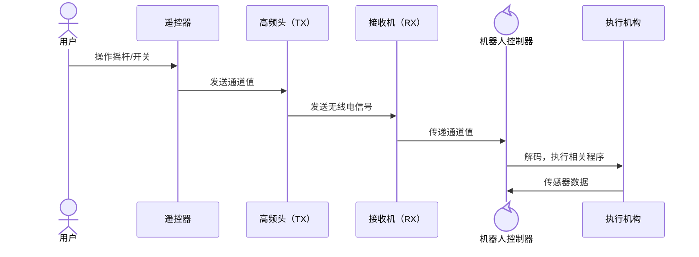

遥控器采集各个摇杆、开关的位置，并将其转换为通道值，通过高频头发送无线电信号。接收机接收到无线电信号后，将其转换为通道值，传递给机器人控制器，控制机器人的动作。

以已经停产的大疆遥控器DT7&DR16为例，其遥控器本身具备射频模块（高频头），在遥控器DT7与接收机DR16绑定后，DT7将各个拨杆和开关的位置转换为通道值，发送到DR16，DR16再通过Dbus协议将通道值传递给机器人控制器。而在硬件层，Dbus为**负电平单工串行**通信协议，通常我们会在单片机侧通过一个反向电平转换电路，将接收机的TX引脚接入，并依据其通信协议进行数据解析，从而获取各个通道的值。与此类似的还有更通用的sbus以及富斯的ibus协议（实际上还有种在航模中较为常用的PPM，其传输数据为PWM形式，但在本文中不做深入解释）。

这些单向的通讯协议除了在硬件上的都采用串行外，其报文结构也是简单的由标志位、各通道值以及校验位组成，便于解析，也足够满足大多数的遥控需求。

值得注意的是，这类传统的遥控方式通常仅支持单向的通道值传输，在机器人控制的实际应用中，可能会出现通道数量、报文灵活性，以及无法满足回传需求等问题。

## 双向遥控方式
为了解决传统遥控方式的局限性，以**tbs-CRSF（Crossfire）**和**Mavlink**为代表的双向遥控方案在近几年的航模领域得到了广泛应用。而ELRS作为近年来兴起的开源双向遥控方案，其采用CRSF协议，并以开源的软硬件设计，以及高性价比与良好的性能，迅速在航模领域占据了一席之地。

以ELRS为例，采用CRSF进行双向遥控方式的工作流程如下图所示（Mavlink通讯链路与之类似）：

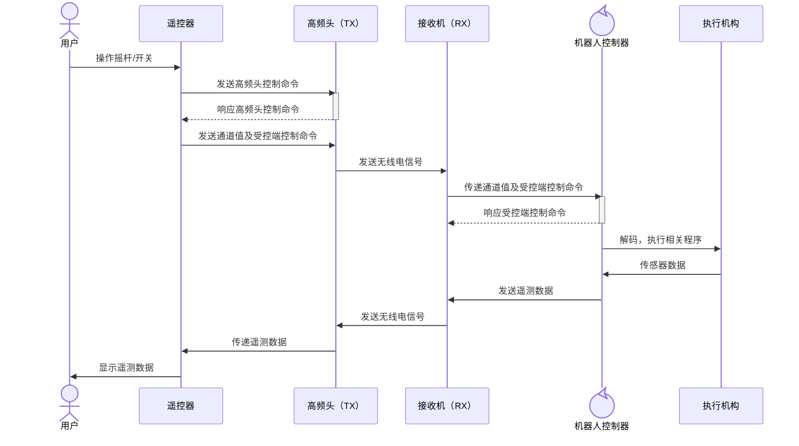

# 实际应用

## 硬件选择

为什么选择ELRS？
> ExpressLRS 是一种高性能、开源的无线电控制协议，旨在成为一个极其快速（Express）且极其敏感（Long Range）的系统。ELRS 使用 Semtech SX12xx 系列 LoRa 芯片（以及LR1121），并采用轻量级、高度优化的空中（over-the-air，OTA）协议，相较于传统的 RC 链接提供了卓越的性能。虽然 ExpressLRS 最初起源于 DIY 和改造硬件，但现在已有大量制造商生产高质量、低成本的发射器和接收器，使任何人都能轻松上手！
> ——摘自[ExpressLRS FAQ](https://www.expresslrs.org/faq/)


在实际应用中，遥控器和接收机的选择较为多样化，本文以目前市场上性价比较高的、应用较广的 Radiomaster Pocket 作为遥控器（内置ELRS高频头），搭配贝壳BAYCKRC 2.4GHz Nano RX接收机为例，介绍下具体的应用步骤。

1. Radiomaster Pocket 遥控器
    - 运行EdgeTX操作系统；
    - 128*64黑白屏；
    - 最大16通道输出（因为有混控的存在，实际的可传输的通道数最大值取决于接收机，但如果接收机使用的是串行协议，一般最大就是16通道）
    - 两颗18650电池供电，可通过下方USB-C接口充电；

    - 可选内置ELRS或者CC2500（多协议）高频头版本，但在实际应用中，建议选择内置ELRS高频头版本，本文后续均以此版本为例；
    - 内置ELRS高频头支持2.4Ghz频段，最大功率250mW。
    - 后背拥有一个Nano插槽，可以安装同样采用Nano插槽的外置高频头等的模块；
    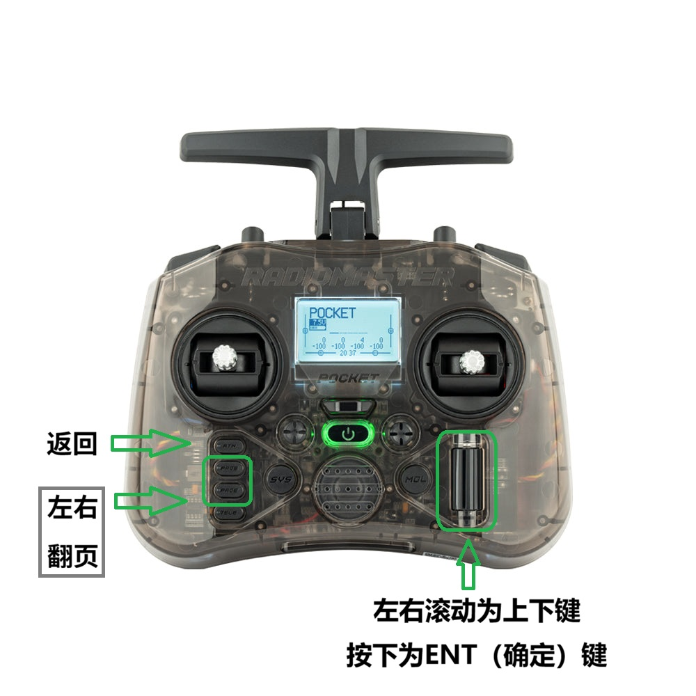

> [!NOTE]
> pocket拥有上下两个USB-C接口，其中下方的**仅可用作充电**，上方的USB-C接口用于数据传输，不会进行充电

2. 贝壳BAYCKRC 2.4GHz Nano RX接收机
    - ELRS 2.4Ghz接收机；
    - 串行接口；
    - 最大回传功率100mW;
    - 5V供电；
    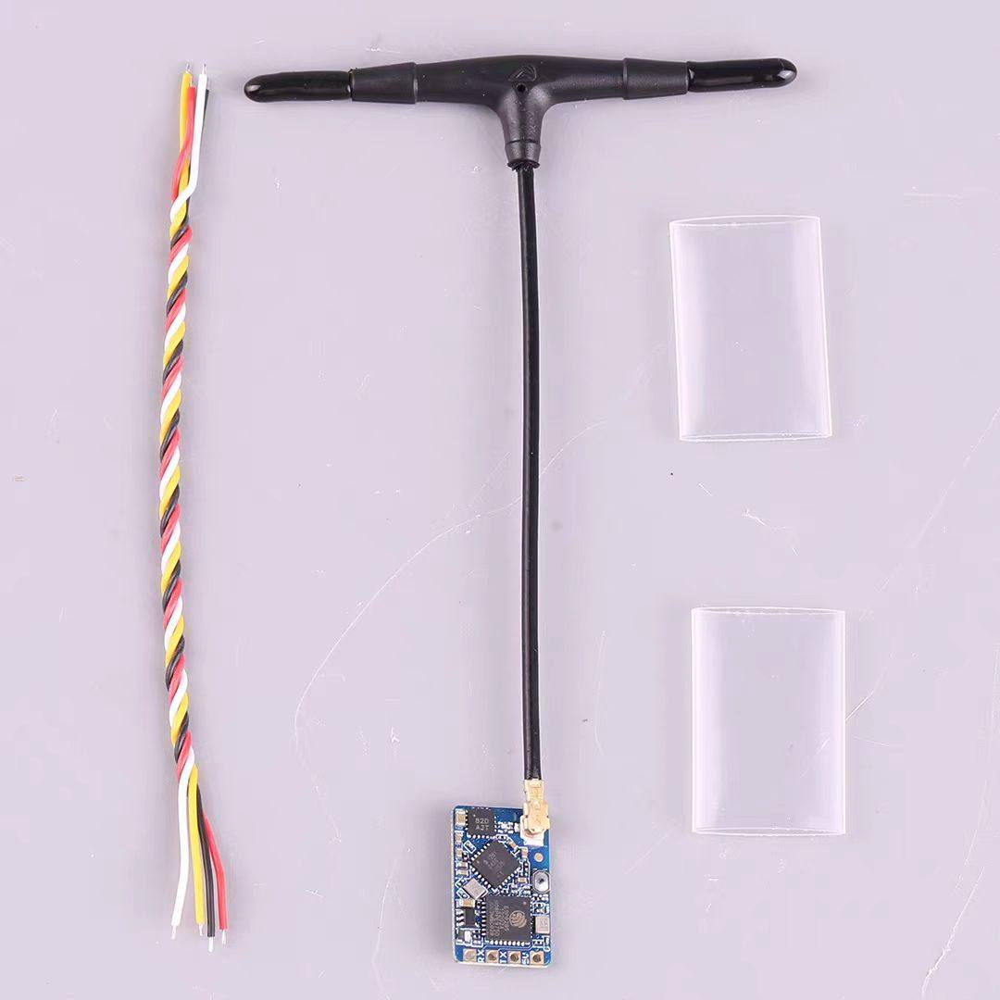

## 使用

> [!NOTE] 
> 1、为方便读者阅读，本文中的ELRS脚本页面将采用自制遥控器系统（后续开源）截图代替，脚本运行界面与实际EdgeTX系统类似，仅在部分细节上有所差异。<br>
> 2、下文中高频头设置部分截图中，显示的高频头为刷写了高频头固件的`贝壳BAYCKRC 2.4Ghz Nano RX`模块，在通常情况下，你应当看到的名称带有`TX`字样，表示其为高频头模块。


### 遥控器系统
   Pocket出厂时预装EdgeTX操作系统，而EdgeTX本身功能比较多样，读者可参考[EdgeTX官方文档](https://edgetx.gitbook.io/)进行相关设置和使用，也可参考[视频](https://www.bilibili.com/video/BV16N4y197Gi)。下文将主要介绍与ELRS相关的设置（如对频、协议选择、回传设置、发送频率）。
### 对频
   ELRS拥有两种对频方法：
- **传统对频**（每次开机连接以及重连速度较慢，不推荐，仅适合临时使用）：
    1. 快速连续上下电接收机三次（通-断-通-断-通-断-通），接收机指示灯双闪，即进入对频状态。此时在遥控器上选择对应的接收机型号进行对频即可。
    2. 在遥控器上依次按下`SYS`->`ExpressLRS`进入ELRS脚本页面（如下图）。
    
    3. 波动转轮，向下移动光标至`[Bind]`，按下`ENT`键，进入对频状态，页面会显示`Binding...`，等待接收机指示灯变为常亮，即表示对频成功。
    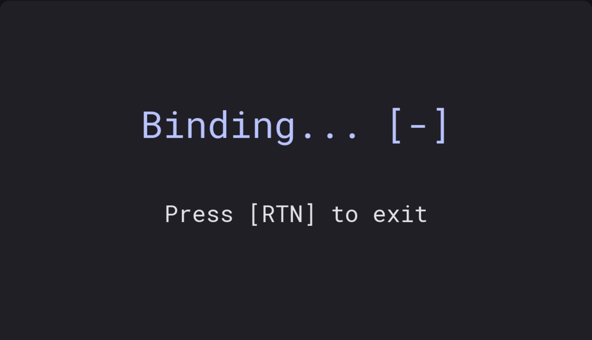
- **配对码对频**（连接速度快，推荐使用）：
    1. 如上步骤2，进入ELRS脚本页面。
    2. 移动光标至`WiFi Connectivity`，按下`ENT`键，进入WiFi连接页面。
    3. 光标移动至`Enable WiFi`，（其下还有个选项，为`Enable Rx Wifi`，用以开启当前已连接的接收机的WiFi功能，注意区分），按下`ENT`键，开启高频头WiFi AP热点，此时页面会显示为WiFi模式，请保持这个页面，不要退出。
    4. 使用手机或电脑连接到该WiFi热点，热点名称为`ExpressLRS TX`，密码默认为`expresslrs`（注意连接可能会花费一些时间，请耐心等待）。
    5. 连接到WiFi后，如果出现类似`该网络无法上网，是否继续保持连接`的提示，请务必选择继续连接；如果出现`登录到网络`等类似提示，请选择进入认证页面，若未出现认证页面，请手动打开浏览器，访问[http://10.0.0.1](http://10.0.0.1)，进入高频头的Web管理页面。
    6. 在`Binding Phrase`输入框中，输入一个自定的配对码（可以是数字、字母、符号），随着配对码的输入，其下方的`binding UID`的内容与状态也会随之变化，紫色的`Modified`为正在编辑状态，按下下方的`SAVE`后随即变为绿色的`Overriden`（部分设备可能显示为`Bound`），表示配对码已复写。在接收机重启后再次进入该页面，`Binding Phrase`将为空状态，而`binding UID`则会与保存时一致。
    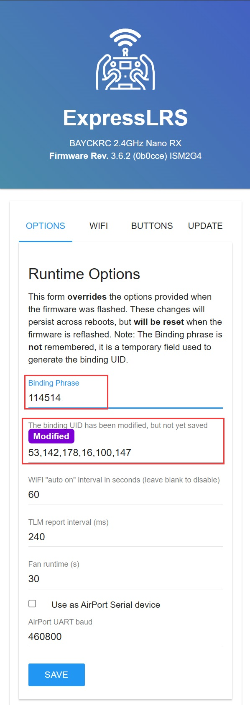
    7. 接收机上电，且保持未连接状态1分钟，待指示灯快闪，即已进入WiFi AP模式。
    8. 同上述步骤，连接并进入接收机的Web管理页面，需要注意的是，接收机的热点名称为`ExpressLRS RX`，密码同样为`expresslrs`。
    9. 在接收机的Web页面中，同样在`Binding Phrase`输入框中，输入与高频头相同的配对码，完成输入后，确保`Binding UID`与设置高频头步骤中的保持一致，点击`SAVE`按钮保存。
    10. 完成二者的配对码设置后，建议将其重新上电，待接收机指示灯常亮，即表示对频成功。

> [!NOTE]
> 首次连接**可能需要较长时间**，请耐心等待，如长时间未连接，可尝试先将高频头重新上电，再将接收机重新上电。完成连接后，后续再次连接的速度会大幅提升。

___

### 协议选择

> [!IMPORTANT]
> 硬件上，内置高频头通常采用的**双线全双工**的串行协议，而外置高频头通常采用的**单线半双工**的串行协议，请务必注意区分。

如[双向通讯方式](#双向遥控方式)中所述，遥控器与高频头、接收机与受控端都采用串行协议进行通讯，而遥控器与ELRS高频头通常采用`CRSF`协议进行通讯，我们不需要做修改，故本节主要讲述的便是针对**接收机与受控端**进行的通讯。

ELRS支持多种串行协议，如`CRSF`、`SBUS`、`Mavlink`等。

#### 协议设置

该设置拥有两个实现途径：
- **遥控器ELRS脚本页面设置**（推荐）：
    1. 确保遥控器与接收机已连接，接收机指示灯常亮。
    2. 参考[对频](#对频)中步骤，进入ELRS脚本页面。
    3. 下移光标至`Other Devices`，按下`ENT`键，进入其他设备设置页面。
   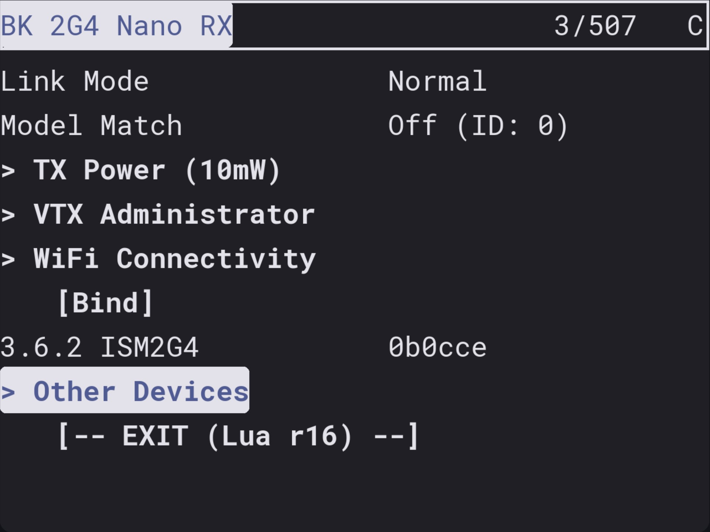
    4. 确保光标在你的接收机设备名称上（贝壳BAYCKRC 2.4GHz Nano RX显示名称为`BK 2G4 Nano RX`），按下`ENT`键，进入接收机设置页面（如下图）。
   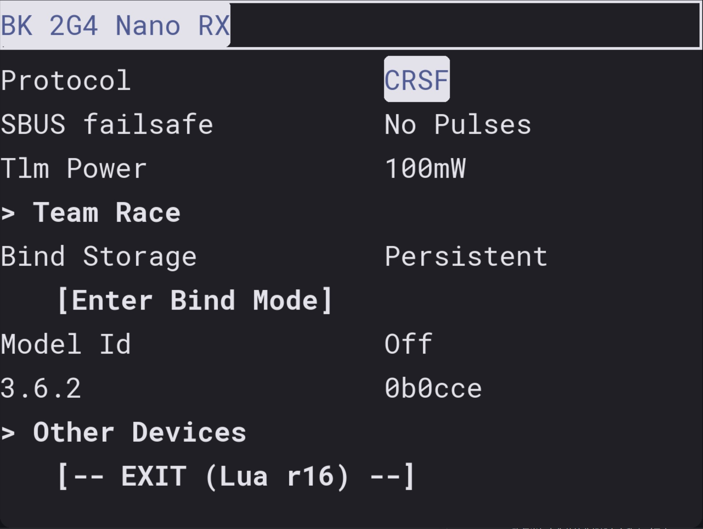
    5. 光标移动至`Protocol`选项，按下`ENT`键，滚动拨轮，即可选择所需的协议类型，选择完成后，按下`ENT`键确认。
- **接收机Web管理页面设置**：
    1. 参考[对频](#对频)中步骤，进入接收机的Web管理页面。
    2. 在页面中找到`Protocol`选项，点击其右侧的下拉菜单，选择所需的协议类型。
    3. 选择完成后，点击页面下方的`SAVE`按钮保存设置。

> [!NOTE]
> 如果在进入接收机ELRS脚本页面时加载缓慢，可以通过修改`Packet Rate`与`Telem Rate`来改善，后续章节会详细介绍这两个选项的作用及设置建议。

#### 协议选择建议及应用

本文主要着重介绍`CRSF`、`SBUS`以及`Invert SBUS`三种选项的特征与注意要点。

##### 协议特征与注意要点

1. **SBUS**：
    - 少部分接收机可能不支持SBUS协议，请务必确认接收机支持该协议；
    - 采用单线单工串行通信，该模式下，仅需将接收机的`TX`端连接到受控端的`RX`端；
    - 协议解析办法与大疆的Dbus类似，具体解码方向的有关资料较为丰富，可自行查阅，本文不再赘述；
    - 波特率常为100000bps，并且采用负电平，使用时需要增加一个反向电平转换电路。
    - 不具备回传功能。

2. **Invert SBUS**：
    - 反转SBUS协议，其为正电平形式的SBUS，使用时无需增加反向电平转换电路，可直接接入常规的串行接口。

3. **CRSF**：
    - 该协议为默认设置协议，无需修改即可使用；
    - 采用双线全双工串行通信，该模式下，需将接收机的`TX`端连接到受控端的`RX`端，同时将接收机的`RX`端连接到受控端的`TX`端；
    - 波特率常为420000bps,一个起始位、八个数据位、无奇偶校验、1个停止位，并且采用正电平，使用时无需增加反向电平转换电路；

> [!NOTE]
> 即使受控端不向接收机发送数据，也并不会影响遥控的正常进行，该场景下也可以不连接接收机的`RX`端与受控端的`TX`端。

##### CRSF协议解析简介

`CRSF`与`SBUS`协议截然不同，其报文依据结构可分为**广播帧**与**拓展帧**两种，通常对广播帧进行编解码便可完成大部分场景下的需求，下文将主要就实现最基本的遥控功能进行介绍。

本文主要参考了由**黑羊Team BlackSheep**发布的[CRSF协议文档](https://github.com/tbs-fpv/tbs-CRSF-spec/blob/main/CRSF.md)，如后续有进一步的开发需要，读者可前往查阅更为详细的资料。

`CRSF`相关编解码的实例代码，可参考笔者的开源仓库[ZombieFly/STM32-DuplexCRSF](https://github.com/ZombieFly/STM32-DuplexCRSF)

1. **广播帧**：
    - 以最常用的通道数据帧（`RC Channels Packed Payload(0x16)`）为例进行介绍：

        如下图所示，广播帧主要由`同步字节（Sync byte）`、`帧长度（Frame Length）`、`类型（Type）`、`有效载荷（Payload）`、`循环冗余校验（CRC）`五个部分组成：
        ```mermaid
        flowchart LR
            id0[Sync byte] --- id1[Frame_Length]
            subgraph Frame_Length
                direction LR
                id2[Type] --- id3[Payload] --- id4[CRC]
            end
            id1 --- id2
        ```
        - `同步字节`：实为接收设备的地址，而通道数据帧所属于`Flight controller`，即`0xC8`，占1字节；
        - `帧长度`：表示后续帧内容的长度，即从`类型（Type）`到`CRC`的字节数总和，不包含`同步字节`与`帧长度`本身，亦或表示为完整帧总长减去2，占1字节；
        > `CRSF`协议规定，完整的一帧数据包大小应当为`4~64`字节，即`帧长度`的数值范围为`2~62`,超出该范围的数据包应被视为无效
        - `类型`：表示该帧的类型，通道数据帧所属于`RC Channels Packed Payload`，即`0x16`，占1字节；
        - `有效载荷`：依据帧类型的不同而不同，而通道数据帧的有效载荷主要包含16个通道值，每个通道使用11个位，占22字节；
    
        据此，我们可以得到接收机发送到受控端的通道数据帧的完整结构如下表所示：
        
        ```mermaid
        ---
        title: "RC Channels Packed 通道数据帧结构"
        ---
        packet
        0-0: "0xC8"
        1-1: "0x18"
        2-2: "0x16"
        3-24: "通道值1-16(每个通道11位)"
        25-25: "CRC"
        ```

        具体的通道值解析方式，可参考[ExpressLRS/ExpressLRS](https://github.com/ExpressLRS/ExpressLRS/blob/56d5f158773c232a86bc5bd9c738a9496c353d04/src/lib/tx-CRSF/TXModuleEndpoint.cpp#L87)及[ZombieFly/STM32-DuplexCRSF/app/CRSF_utils.h](https://github.com/ZombieFly/STM32-DuplexCRSF/blob/master/app/CRSF_utils.h#L101)中的解码实现。
        
        如需使用DMA空闲中断接收，可参考[ZombieFly/STM32-DuplexCRSF/app/CRSF.c](https://github.com/ZombieFly/STM32-DuplexCRSF/blob/master/app/CRSF.c#L36)

        完成通道数据帧的解析后，即可获取16个通道的值，从而实现最基本的遥控功能。

    ___

    - 更进一步
  
        如果读者目前的需求仅是使用单片机读取出ELRS射频系统的遥控通道，以上内容足够使用。
        
        而为了满足读者后续的开发需求提升，现对广播帧中的`同步字节（Sync byte）`与`类型（Type）`进行补充说明：

        - `同步字节`：
            又称`设备地址（Device Address）`，是由`CRSF`协议将遥控各环节的硬件设备与传感器等对象划分的不同的设备地址，以下为较为常用的地址，完整的设备地址见[附录](#同步字节sync-byte设备地址device-addresses)：
            | 设备地址（十六进制） |    描述                     |
            |----------------------|--------------------------|
            | 0x00                 | 广播地址（Broadcast），所有设备均可接收 |
            | 0xC8                 | 飞控（Flight controller），原指接收机所连接的飞控，此处也可以理解为我们的机器人（受控端   |
            | 0xEA                 | 遥控器（Remote controller） |
            | 0xEC                 | 接收机（R/C receiver / Crossfire RX）|
            | ...                  | ...                      |

        - `类型`：
            帧类型定义了该帧的具体内容与用途，如通道值、传感器值等，`CRSF`协议约定，帧类型`0x27（保留）`以下的均称之为**广播帧（Broadcast Frame）**，而往后的均称之为**拓展帧（Extended Frame）**。

            > [!WARNING]
            > 请将`广播帧（Broadcast Frame）`与`同步字节（Sync byte）`中的`广播地址（Broadcast address）`区分开来<br>广播帧（Broadcast Frame）是指帧类型在`0x27`以下的帧，而广播地址（Broadcast address）是指代表所有设备均可接收的设备地址`0x00`。

            **广播帧**类型主要为较为基础的通道传递与GPS、电压电流、海拔、速度等的各类传感器数据，常用的类型如下表所示，完整类型见附录，各个类型所对应的具体协议见[CRSF协议文档](https://github.com/tbs-fpv/tbs-crsf-spec/blob/main/crsf.md#broadcast-frame-types)，笔者[开源仓库](https://github.com/ZombieFly/STM32-DuplexCRSF/blob/master/app/crsf_utils.h)内也提供有GPS与电池传感器回传的例程代码：
            | 类型（十六进制） |    描述                     |
            |------------------|--------------------------|
            | 0x02             | GPS                      |
            | 0x07             | 水平速度（Variometer Sensor）    |
            | 0x08            | 电池传感器（Battery Sensor），具体包括电压、电流、已使用容量、剩余容量|
            | 0x0B            | 心跳包（HeartBeat）    |
            | 0x13           | 加速度/角度数据（Accel/Gyro）    |
            | 0x16           | 通道数据帧（RC Channels Packed Payload） |
            | ...              | ...                      |


1. **拓展帧**：

    即类型为`Parameter Ping Devices(0x28)`及往后（除非明确提及）的帧，相比广播帧，其携带有`目标地址（Destination Address）`与`源地址（Origin Address）`。拓展帧更偏向于设备间的复杂交互，以配置参数读写为主要目的，本章暂不做深入介绍，将在后续章节中进行深入。

___

#### 数据包速率与回传比例

通过上文对`CRSF`协议的介绍，我们可以了解到，高频头与接收机之间的通讯是通过`CRSF`数据包进行传输的，高频头对接收机的参数的读写，与通道数据共用这同一套射频链路。
同时，在上文的[协议设置](#协议设置)中，提到在进入接收机设置页面时，可能会出现加载缓慢的情况，而这通常与`Packet Rate`与`Telem Rate`两个选项有关。而如果在实际遥控过程中，出现接收机数据不够平滑、响应迟钝等问题，则也可以考虑检查`Packet Rate`的设置。

接下来，我们将对这两项参数进行介绍

1. **数据包速率（Packet Rate）**：
    - 该选项用于设置高频头向接收机发送数据包的频率，单位为Hz，常见的选项有`50Hz`、`100Hz`、`150Hz`、`333Hz Full`、`500Hz`、`F1000Hz`等；
    - 该选项数值越大，表示高频头向接收机发送数据包的频率越高，从而可以提升遥控的响应速度与平滑度，但同时也会增加射频链路的负载，影响射频距离，以及增大受控端的计算负担；
    - 建议根据实际需求进行选择，一般情况下，`250Hz`、`333Hz Full`以及`500Hz`即可满足大部分应用需求，同时考虑到可能的对全分辨率通道的需求（将在后文介绍Packet Rate与通道分辨率间的关系），在权衡传输速率的前提下，推荐选择`333Hz Full`。
    - 在设置成`333Hz Full`发送频率后，推荐将`Switch Mode`设置为`16ch Rate/2`，设置理由将在下文解释；
    - 包速率选项中的`Full`、`D`、`F`等标注的含义见下图：
    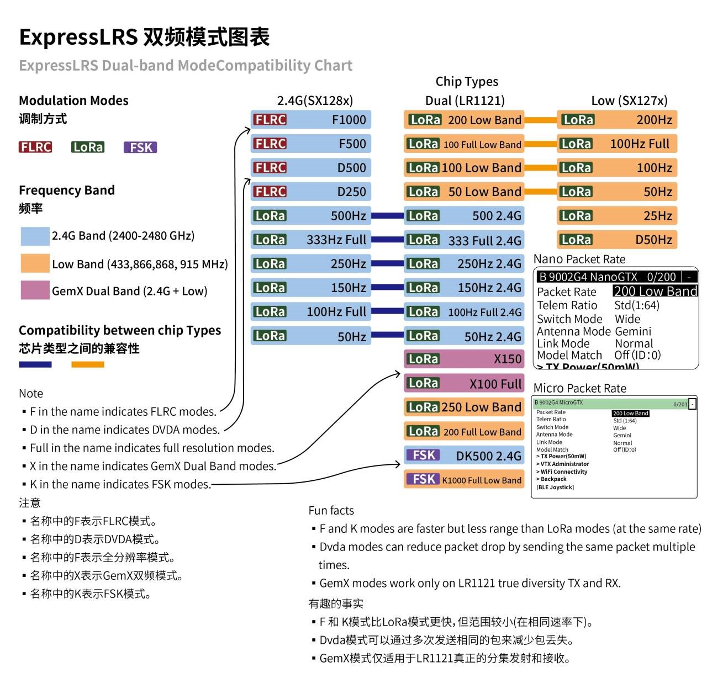

> [!NOTE]
> 现在市面上大部分2.4GHz ELRS产品仍是以SX128x系列芯片为主，而2025年陆续上市的ELRS产品中，大多数都在换用LR1121芯片，该芯片可以选择在2.4GHz或Sub-GHz（Low Band）频段工作，并且在Sub-GHz频段下，拥有更远的传输距离与穿透能力，而装有双LR1121的射频产品，可以使用双频分集模式（GemX Dual Band），理论上拥有更好的信号传输表现，读者可根据实际需求进行选择。

2. **回传比例（Telem Rate）**：
    - 该选项用于设置接收机向高频头发送回传数据的频率与高频头向接收机发送数据包频率的比例关系，令回传比例(Telem rate)为 $R_{telem}$ ，回传频率为 $f_{telem}$ ，遥控频率为 $f_{rc}$ 则有：

    $$R_{telem} = \frac{f_{telem}}{f_{rc}}$$

    可得

    $$f_{telem} = R_{telem} \times f_{rc}$$

    - 在相同的数据包速率（Packet Rate）设置下，回传比例（Telem Rate）数值越小，表示接收机向高频头发送回传数据的频率越低，通常使用建议直接选择`1:2`选项；

____

### 输入与混控

在完成上述设置后，遥控器与接收机之间的连接便已建立，而通道值的传输也已可以实现。通常情况下，使用起来并没有什么问题，对吗？实际上，单片机通过接收机获取到的通道值，在现代遥控器系统中，往往并不是直接对应遥控器上各个摇杆与开关的位置，而是输入（逻辑开关、全局变量、回传，甚至混控后的通道输出也可以是输入）经过了混控（Mixing）后的结果。他们之间的关系如下图所示：

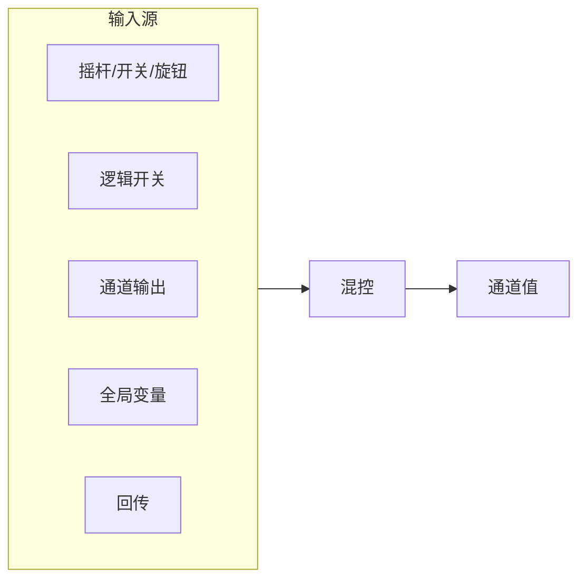


幸运的是，RadioMaster Pocket的出厂SD卡内配置便是将各个摇杆与开关一一映射到了单独的通道上，读者可以直接使用。如果使用的其他遥控器（比如FlySky PA01），恰好没有将各个摇杆与开关映射到单独的通道上，以及需要进行自定义的通道设置（设置曲线、逻辑通道等），则需要进行混控设置。


#### 输入设置

在正式开始输入设定之前，我们需要先了解下遥控器上最重要的两对摇杆。在RC领域中，将遥控器上的四个主摇杆定义为`A（横滚）`、`E（俯仰）`、`T（油门）`、`R（偏航）`，通常从通道1~4依次排序为`AETR`，而这四者在物理的摇杆上，主流分为两种布局方式，分别为`日本手（Mode 1）`与`美国手（Mode 2）`，二者是完全左右对称的，如下图所示：

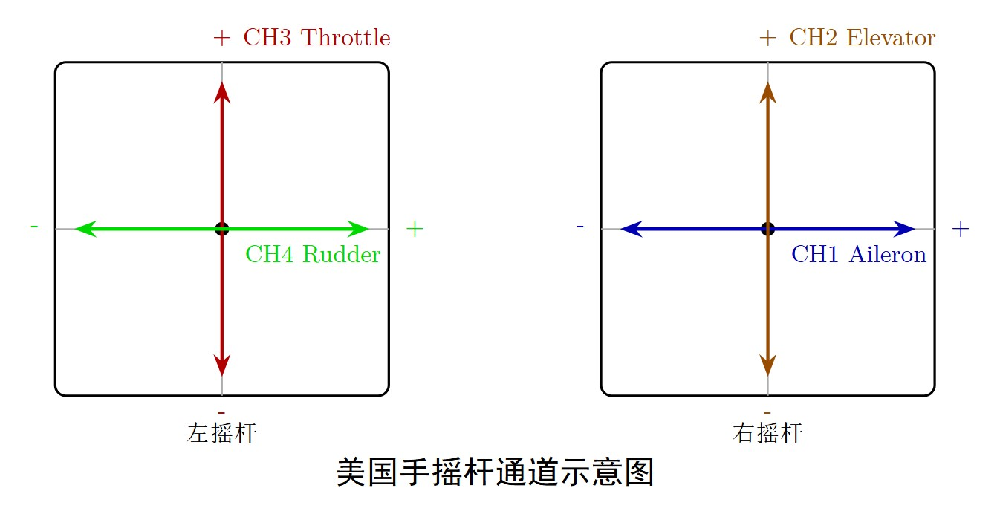 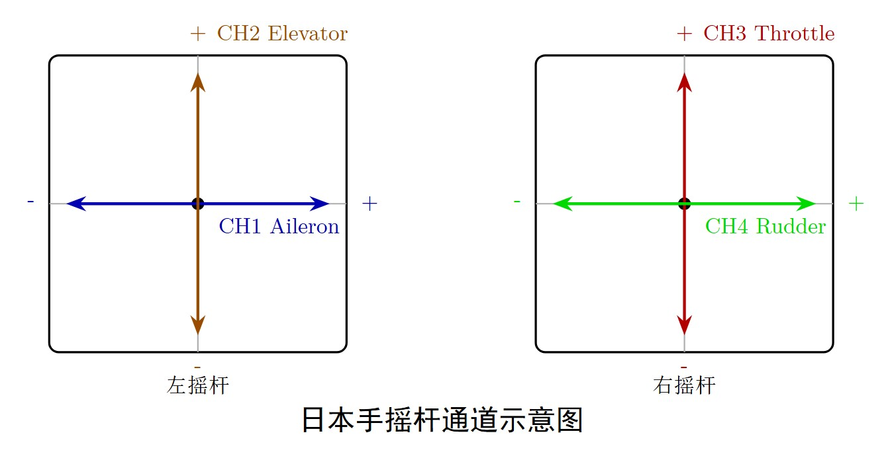

> [!NOTE]
> 这些来自模型领域的术语与定义，实际上在机器人领域并不常用，但为了方便读者理解，本文仍然采用这些术语进行描述，下文中将以`美国手（Mode 2）`为例进行介绍。

##### 设置

RadioMaster Pocket预装EdgeTX，


# 附录

## 同步字节（Sync byte）/设备地址（Device Addresses）
表格来源[^1]
| 设备地址（十六进制） | 设备名称               |
|----------------------|------------------------|
| 0x00                 | 广播(Broadcast)              |
| 0x0E                 | Cloud                  |
| 0x10                 | USB设备（USB Device）· ，部分高频头带有USB-C接口   |
| 0x12                 | ELRS背包（Bluetooth Module/WiFi）   |
| 0x13                 | Wi-Fi receiver (mobile game/simulator) |
| 0x14                 | 数字图传接收端（Video Receiver）         |
| 0x20-0x7F            | Dynamic address space for NAT |
| 0x80                 | OSD / TBS CORE PNP PRO  |
| 0x90                 | ESC 1                   |
| 0x91                 | ESC 2                   |
| 0x92                 | ESC 3                   |
| 0x93                 | ESC 4                   |
| 0x94                 | ESC 5                   |
| 0x95                 | ESC 6                   |
| 0x96                 | ESC 7                   |
| 0x97                 | ESC 8                   |
| 0x8A                 | Reserved                |
| 0xB0                 | Crossfire reserved      |
| 0xB2                 | Crossfire reserved      |
| 0xC0                 | Voltage/ Current Sensor / PNP PRO digital current sensor |
| 0xC2                 | GPS / PNP PRO GPS       |
| 0xC4                 | TBS Blackbox            |
| 0xC8                 | 飞控(Flight controller)       |
| 0xCA                 | Reserved                |
| 0xCC                 | Race tag                |
| 0xCE                 | VTX                     |
| 0xEA                 | 遥控器（Remote Control）          |
| 0xEC                 | 接收机（R/C Receiver / Crossfire Rx） |
| 0xEE                 | 高频头（R/C Transmitter Module / Crossfire Tx） |
| 0xF0                 | reserved                |
| 0xF2                 | reserved                |

## 广播帧类型（Broadcast Frame Types）
表格来源及详细协议[^2]
| 类型（十六进制） | 描述                          |
|------------------|-------------------------------|
| 0x02             | GPS                           |
| 0x03 | GPS时间（GPS Time） |
| 0x06 | GPS扩展（GPS Extended） |
| 0x07 | 变率计（Variometer Sensor） |
| 0x08 | 电池传感器（Battery Sensor） |
| 0x09 | 气压高度与垂直速度（Barometric Altitude & Vertical Speed） |
| 0x0A | 空速（Airspeed） |
| 0x0B | 心跳（Heartbeat） |
| 0x0C | 转速（RPM） |
| 0x0D | 温度（TEMP） |
| 0x0E | 电压（Voltages） |
| 0x0F | 已停用（Discontinued） |
| 0x10 | 图传遥测（VTX Telemetry） |
| 0x11 | 气压计（Barometer） |
| 0x12 | 磁力计（Magnetometer） |
| 0x13 | 加速度/陀螺仪（Accel/Gyro） |
| 0x14 | 链路统计（Link Statistics） |
| 0x16 | RC通道打包载荷（RC Channels Packed Payload） |
| 0x17 | RC通道子集打包（Subset RC Channels Packed） |
| 0x18 | RC通道打包11位（未使用）（RC Channels Packed 11-bits, Unused） |
| 0x19–0x1B | Crossfire保留（Reserved Crossfire） |
| 0x1C | 链路统计RX（Link Statistics RX） |
| 0x1D | 链路统计TX（Link Statistics TX） |
| 0x1E | 姿态（Attitude） |
| 0x1F | MAVLink飞控（MAVLink FC） |
| 0x21 | 飞行模式（Flight Mode） |
| 0x22 | ESP-NOW消息（ESP_NOW Messages） |
| 0x27 | 保留（Reserved） |

# 参考资料
[^1]: https://github.com/tbs-fpv/tbs-crsf-spec/blob/main/crsf.md#device-addresses
[^2]: https://github.com/tbs-fpv/tbs-crsf-spec/blob/main/crsf.md#broadcast-frame-types