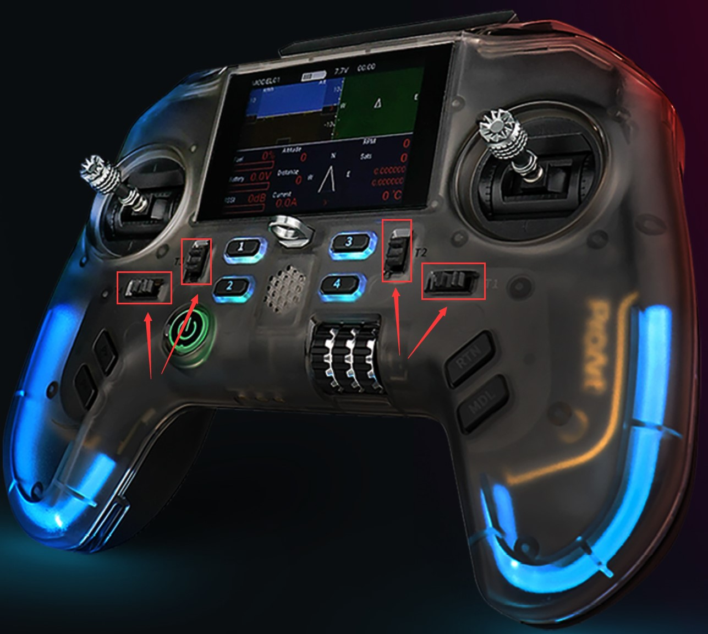
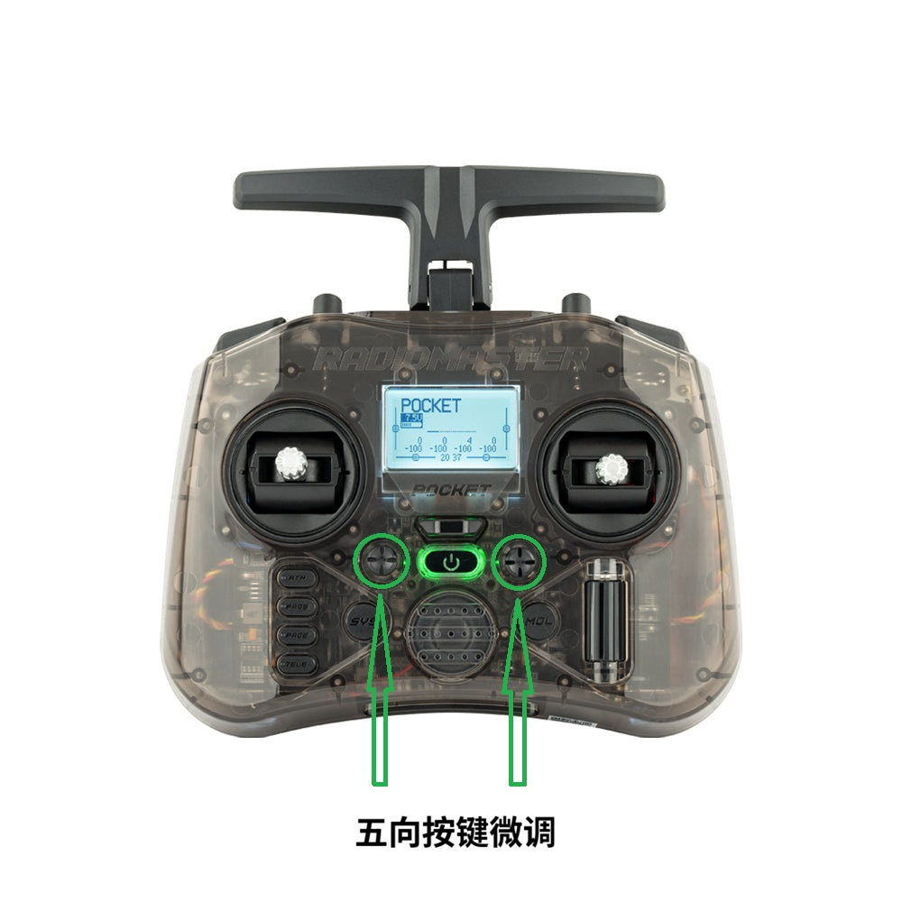

# EdgeTX遥控的微调按键关闭及复用 <!-- omit from toc -->

# 目录 <!-- omit from toc -->
- [概述](#概述)
- [微调键在哪](#微调键在哪)

# 概述
在各类搭载EdgeTX固件的遥控器中，通常具有四个微调按键（Trim buttons），在飞行器遥控中，因为电机安装方向或其他机械因素的影响，微调按键常用于对通道值进行微调，以达到更好的飞行控制效果。
然而，在机器人遥控应用中，因通常采用闭环控制，在正确完成通道校准的前提下，微调按键的作用相对有限，且在某些情况下，误触微调按键可能会导致机器人行为异常。为此，本文介绍如何在EdgeTX中关闭微调按键的功能，以及将其复用于其他用途。

# 微调键在哪
微调按键通常位于遥控器的前面板，并且在通常情况下，微调键设计是用以微调摇杆四个通道值的，故其一般是位于靠近左右摇杆的位置，实体按键形态通常主要有两种：
- 独立按键式：每个微调按键为独立的实体按键，通常标有“+”和“-”符号，或者编辑有形如`T1`的位号（如Flysky PA01、Radiomaster Tx15、Jumper T15）。

- 五向按钮式：四个微调按键集成在两个五向按钮中，上下与左右对应独立按键的两个单通道微调（如Radiomaster Pocket），部分遥控器的五项按键中心位置长按可以作为微调归零键（如Radiomaster T8L）。

